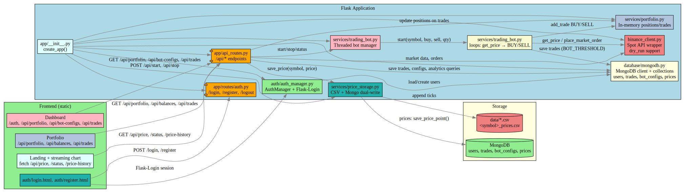
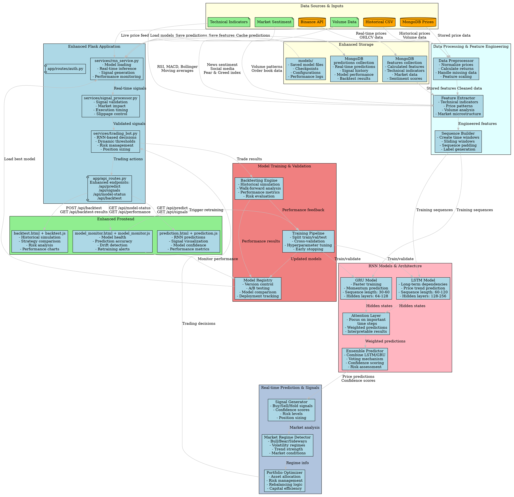

# RNN Crypto Bot (Binance Testnet)

Flask-based modular crypto trading bot using Binance Spot Testnet. Features threshold strategy, portfolio tracking, multi-currency support, and local price storage.

## ✨ Features

### 🎯 Trading Bot
- **Threshold Strategy**: Buy at low threshold, sell at high threshold
- **Position Tracking**: Prevents repeated orders, tracks holdings
- **Dynamic Dry-Run**: Toggle between simulation and real trading
- **Real-time Monitoring**: Live price updates and bot status

### 📊 Portfolio Management
- **Position Tracking**: Real-time PnL calculation
- **Trade History**: Complete record of all executed trades
- **Balance Monitoring**: Account balances from Binance
- **Portfolio Dashboard**: Visual summary with profit/loss tracking

### 📈 Multi-Currency Support
- **Symbol Selection**: Choose from 50+ trading pairs
- **Time-based Charts**: 1H, 1D, 3D, 1W, 1M periods
- **Historical Data**: Local CSV storage for price history
- **Interactive Charts**: Chart.js with zoom and tooltips

### 💾 Local Storage
- **CSV Database**: Automatic price history storage
- **Data Persistence**: Maintains historical data across restarts
- **Period Filtering**: Efficient time-based data retrieval
- **Auto Cleanup**: Removes old data to save space

## 🚀 Setup

1. **Clone and setup environment**:
```bash
cd /home/abhilash/codespace/rnn_crypto
python3 -m venv .venv && source .venv/bin/activate
pip install -r requirements.txt
```

2. **Configure Binance Testnet**:
```bash
cp .env.example .env
# Edit .env and add your Binance testnet API keys
# Get keys from: https://testnet.binance.vision/
```

3. **Run the application**:
```bash
python run.py
```

4. **Access the application**:
- **Trading Bot**: `http://localhost:5000/`
- **Portfolio**: `http://localhost:5000/portfolio`


## Overview


### Current Architecture (Colorful)

```dot
digraph RnnCryptoCurrent {
  rankdir=LR;
  node [shape=box, style=filled];
  edge [color=gray];

  subgraph cluster_flask {
    label="Flask Application";
    style=filled;
    fillcolor=lightblue;
    
    "create_app()" [label="app/__init__.py\ncreate_app()", fillcolor=lightcyan];
    "AuthManager" [label="auth/auth_manager.py\nAuthManager + Flask-Login", fillcolor=lightgreen];
    "MongoDB" [label="database/mongodb.py\nMongoDB client + collections\nusers, trades, bot_configs, prices", fillcolor=lightyellow];
    "BinanceClient" [label="binance_client.py\nSpot API wrapper\ndry_run support", fillcolor=lightcoral];
    "TradingBotManager" [label="services/trading_bot.py\nThreaded bot manager", fillcolor=lightpink];
    "PortfolioManager" [label="services/portfolio.py\nIn-memory positions/trades", fillcolor=lightsteelblue];
    "PriceStorage" [label="services/price_storage.py\nCSV + Mongo dual-write", fillcolor=lightseagreen];

    "Blueprint: api" [label="app/api_routes.py\n/api/* endpoints", shape=component, fillcolor=orange];
    "Blueprint: auth" [label="app/routes/auth.py\n/login, /register, /logout", shape=component, fillcolor=orange];

    "create_app()" -> "AuthManager";
    "create_app()" -> "MongoDB";
    "create_app()" -> "BinanceClient";
    "create_app()" -> "TradingBotManager";
    "create_app()" -> "PortfolioManager";
    "create_app()" -> "PriceStorage";
    "create_app()" -> "Blueprint: api";
    "create_app()" -> "Blueprint: auth";

    "TradingBotManager" -> "TradingBot thread" [label="start(symbol, buy, sell, qty)"];
    "TradingBot thread" [label="services/trading_bot.py\nloops: get_price → BUY/SELL", fillcolor=lightgoldenrodyellow];
  }

  subgraph cluster_storage {
    label="Storage";
    style=filled;
    fillcolor=lightyellow;
    
    "CSV files" [label="data/*.csv\n<symbol>_prices.csv", shape=cylinder, fillcolor=lightcoral];
    "Mongo collections" [label="MongoDB\nusers, trades, bot_configs, prices", shape=cylinder, fillcolor=lightgreen];
  }

  subgraph cluster_frontend {
    label="Frontend (static)";
    style=filled;
    fillcolor=lightgreen;
    
    "index.html + app.js" [label="Landing + streaming chart\nfetch /api/price, /status, /price-history", fillcolor=lightcyan];
    "dashboard.html + dashboard.js" [label="Dashboard\n/auth, /api/portfolio, /api/bot-configs, /api/trades", fillcolor=lightpink];
    "portfolio.html + portfolio.js" [label="Portfolio\n/api/portfolio, /api/balances, /api/trades", fillcolor=lightsteelblue];
    "auth pages" [label="auth/login.html, auth/register.html", fillcolor=lightseagreen];
  }

  // Data flows
  "index.html + app.js" -> "Blueprint: api" [label="GET /api/price, /status, /price-history"];
  "dashboard.html + dashboard.js" -> "Blueprint: api" [label="GET /api/portfolio, /api/bot-configs, /api/trades\nPOST /api/start, /api/stop"];
  "portfolio.html + portfolio.js" -> "Blueprint: api" [label="GET /api/portfolio, /api/balances, /api/trades"];
  "auth pages" -> "Blueprint: auth" [label="POST /login, /register"];

  "Blueprint: api" -> "TradingBotManager" [label="start/stop/status"];
  "Blueprint: api" -> "PortfolioManager" [label="update positions on trades"];
  "Blueprint: api" -> "MongoDB" [label="save trades, configs, analytics queries"];
  "Blueprint: api" -> "BinanceClient" [label="market data, orders"];
  "Blueprint: api" -> "PriceStorage" [label="save_price(symbol, price)"];

  "PriceStorage" -> "CSV files" [label="append ticks"];
  "PriceStorage" -> "Mongo collections" [label="prices: save_price_point()"];
  "TradingBot thread" -> "BinanceClient" [label="get_price / place_market_order"];
  "TradingBot thread" -> "MongoDB" [label="save trades (BOT_THRESHOLD)"];
  "TradingBot thread" -> "PortfolioManager" [label="add_trade BUY/SELL"];

  // Auth
  "AuthManager" -> "MongoDB" [label="load/create users"];
  "auth pages" -> "AuthManager" [label="Flask-Login session"];
}
```


### Enhanced RNN Architecture


## 📋 API Endpoints

### Trading
- `GET /api/price?symbol=ETHUSDT` - Current price
- `GET /api/price-history?symbol=ETHUSDT&period=1d` - Historical prices
- `GET /api/symbols` - Available trading pairs
- `GET /api/status` - Bot status and dry-run setting
- `POST /api/start` - Start trading bot
- `POST /api/stop` - Stop trading bot
- `POST /api/order` - Place manual order

### Portfolio
- `GET /api/portfolio` - Portfolio summary and positions
- `GET /api/trades` - Recent trade history
- `GET /api/balances` - Account balances

## 🎮 Usage

### Trading Bot Page
1. **Select Currency**: Choose from dropdown (ETH, BTC, BNB, etc.)
2. **Set Chart Period**: 1H, 1D, 3D, 1W, 1M
3. **Configure Thresholds**: Set buy/sell prices
4. **Toggle Dry-Run**: Test without real orders
5. **Start Bot**: Begin automated trading

### Portfolio Page
- **Summary Cards**: Total PnL, realized/unrealized gains
- **Positions Table**: Current holdings with entry prices
- **Balances Table**: All account assets
- **Trades Table**: Complete trade history

## 📁 Data Storage

Price data is automatically stored in CSV files:
```
data/
├── ethusdt_prices.csv
├── btcusdt_prices.csv
└── ...
```

Each CSV contains: `timestamp, price, datetime`

## 🔧 Configuration

Environment variables in `.env`:
```bash
BINANCE_API_KEY=your_testnet_key
BINANCE_API_SECRET=your_testnet_secret
BINANCE_BASE_URL=https://testnet.binance.vision
DEFAULT_SYMBOL=ETHUSDT
ORDER_QUANTITY=0.01
DRY_RUN=true
```

## 🧪 Testing

Test Binance API connectivity:
```bash
python test_binance_api.py
```

## 🔮 Roadmap
- [ ] RNN-based signal generation
- [ ] WebSocket price streaming
- [ ] Advanced chart indicators
- [ ] Backtesting framework
- [ ] Risk management features
- [ ] Multi-exchange support

## 📝 Notes
- Uses Binance Spot Testnet for safe testing
- `DRY_RUN=true` simulates orders without execution
- Local CSV storage provides historical data persistence
- Chart periods: 1H, 1D, 3D, 1W, 1M
- Supports 50+ trading pairs from Binance
